<!-- Banner -->

  

 

  

  

  
  
  
  

---

## About me

Software engineer focused on building scalable, high-performance web applications across **e-commerce**, **SaaS**, **government**, **startups**, and **education**.

I specialize in **Angular**, **React**, and **TypeScript**, with strong experience in responsive design, API integration, and shipping production-ready UI systems.

Currently leading frontend work at **[Binder](https://sahabsystems.com/)**.

  

## What I work on

- Leading frontend architecture for SaaS and ERP platforms
- Performance optimization, reusable component systems, and design-to-code delivery
- Mentoring developers through code reviews and technical guidance
- Collaborating with product, design, and backend teams to ship reliable user experiences

## Tech stack

  
  
  
  
  
  
  
  
  
  
  
  
  
  

  

## Experience

| Role | Company | Period |
| --- | --- | --- |
| Senior Front-End Developer | Binder | Oct 2025 – Present |
| Front-End Developer | Binder | Apr 2024 – Oct 2025 |
| Front-End Developer | VIJUA | Apr 2022 – Apr 2024 |
| Front-End Developer | Vega Data | Oct 2021 – Apr 2022 |
| Front-End Developer | SEJALL84 | Apr 2021 – Oct 2021 |

**At Binder**, I lead frontend work on ERP and RMS SaaS products — driving performance, mentoring engineers, and shipping scalable features with Angular, RxJS, TypeScript, and Tailwind CSS.

## Selected work

| Project | Focus | Stack |
| --- | --- | --- |
| [Binder](https://sahabsystems.com/) | B2B procurement & supply-chain SaaS | React, TypeScript, ERP |
| [Atumion](https://www.atumion.com/) | Renewable energy engineering partner | React, TypeScript, Tailwind |
| [InstaCare](https://www.instacare.online/) | Dental clinic product experience | Next.js, TypeScript |
| [GT1 Motors](https://gt1-omega.vercel.app/) | Luxury vehicle import concierge | Next.js, TypeScript |
| [Medlemo](https://medlemo.com/) | MCCQE exam prep platform | WordPress |
| [Kotobee](https://www.kotobee.com/) | Interactive ebook suite | Web, interactive content |

More projects live on my [portfolio](https://hady-portfolio-pi.vercel.app/).

  

## Education & certifications

- Diploma in Frontend and Cross-Platform Mobile Application — **ITI**
- Diploma in Web Development (Angular & Node.js) — **NTI**
- Web Design for Everybody — **Coursera / University of Michigan & Meta**
- Foundations of UX Design — **Coursera / Google**
- React (Basic) — **HackerRank**

## Connect

  <a href="https://hady-portfolio-pi.vercel.app/">Portfolio</a> ·
  <a href="https://www.linkedin.com/in/hady-hesham-011084159/">LinkedIn</a> ·
  <a href="https://github.com/Hady-7">GitHub</a>

  Open to conversations about frontend engineering, Angular/React architecture, and product-focused UI work.

  

